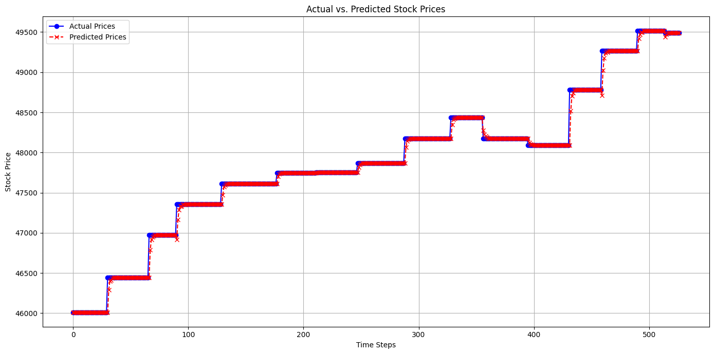

# 📈 Stock Market Prediction using Machine Learning & Sentiment Analysis

## 📌 Overview
This project predicts stock closing prices by combining historical market data with financial news sentiment analysis. It enhances traditional time-series forecasting by integrating **transformer-based financial NLP (FinBERT)** and an **LLM-based sentiment approach (GenAI)** to capture market psychology and news impact.

The solution follows a **production-style ML pipeline** using a **rolling window strategy** to prevent data leakage and simulate real-world deployment.

---

## 🎯 Objectives
- Predict future stock closing prices using historical market data  
- Improve prediction accuracy using financial news sentiment  
- Compare transformer-based sentiment models with LLM-based GenAI approaches  
- Build an interview-ready, production-aware ML pipeline  

---

## 🔧 Technologies Used
- **Programming:** Python  
- **Data Handling:** Pandas, NumPy  
- **Visualization:** Matplotlib  
- **Machine Learning:** Scikit-learn (Random Forest Regressor)  
- **NLP & Transformers:** FinBERT (Hugging Face)  
- **GenAI (LLM):** FLAN-T5 / Zero-shot LLM sentiment (subset-based)  
- **Evaluation:** MAE, RMSE, R²  

---

## 🗂 Dataset Description

### 1️⃣ Stock Market Data
- Historical stock prices (Open, High, Low, Close, Volume)
- Daily time-series data

### 2️⃣ News Headlines
- Financial and market-related news headlines
- Aggregated and aligned by date with stock price data

---

## 🧹 Data Preprocessing
- Removed duplicates and handled missing values  
- Converted date fields to time-series format  
- Cleaned and normalized text data  
- Merged stock data with daily aggregated sentiment features  

---

## 📊 Feature Engineering

### Technical Indicators
To capture market trends and momentum, the following indicators were computed:
- Simple Moving Average (SMA)
- Exponential Moving Average (EMA)
- Relative Strength Index (RSI)
- Moving Average Convergence Divergence (MACD)
- On-Balance Volume (OBV)

### Sentiment Features
- News headlines were converted into sentiment scores  
- Daily sentiment was aggregated and merged with stock data  

---

## 🧠 Sentiment Analysis Approaches

### 1️⃣ FinBERT (Primary – Production)
- Transformer-based model trained on financial text  
- Outputs Positive / Neutral / Negative sentiment probabilities  
- Faster and more stable for large-scale inference  
- Used for sentiment generation across the full dataset  

### 2️⃣ LLM-Based Sentiment (Secondary – GenAI)
- Prompt-based sentiment classification using open-source LLMs  
- Applied on a **small representative subset** for validation and comparison  
- Demonstrates GenAI, prompt engineering, and batching strategies  
- Used to validate sentiment quality rather than bulk inference  

> **Note:** LLM inference is intentionally limited to a subset to balance accuracy and computational efficiency.

---

## 🤖 Machine Learning Model
- **Model Used:** Random Forest Regressor  
- Handles non-linear relationships effectively  
- Robust to noisy financial and sentiment data  

### 🔄 Rolling Window Strategy
- Model is trained only on past data  
- Evaluated on future unseen data  
- Prevents data leakage and mirrors real-world forecasting  

---

## 📈 Model Evaluation
The model is evaluated using standard regression metrics:

- **MAE (Mean Absolute Error):** Average prediction error  
- **RMSE (Root Mean Squared Error):** Penalizes large errors  
- **R² Score:** Variance explained by the model  

### Sample Results
MAE ≈ 58
RMSE ≈ 461
R² ≈ 0.99

These results indicate strong predictive performance while maintaining realistic evaluation practices.

---

## 📉 Visualization
- Actual vs Predicted stock prices  
- Time-series trend comparison  
- Error distribution analysis  

### Actual vs Predicted Stock Prices

---

## 🚀 Key Achievements
- Integrated transformer-based financial sentiment analysis  
- Demonstrated GenAI sentiment classification using LLMs  
- Avoided data leakage using rolling-window validation  
- Combined structured market data with unstructured text data  
- Designed a scalable, production-oriented ML workflow  

---

## 📚 What I Learned
- Time-series forecasting with rolling validation  
- Financial NLP using transformer models  
- Practical trade-offs between LLMs and task-specific models  
- Efficient batch inference and subset-based validation  
- Designing realistic ML pipelines for production use  

---

## 🔮 Future Enhancements
- Deploy the model using FastAPI or Flask  
- Add MLOps components (monitoring, retraining, versioning)  
- Integrate real-time news APIs  
- Experiment with LSTM / Transformer-based forecasting models  
- Deploy on cloud platforms (AWS / GCP / Azure)  

---

## 🧑‍💻 Author
**Karthik Pulusu**  
B.Tech | Data Science & Machine Learning  
Hyderabad, India

